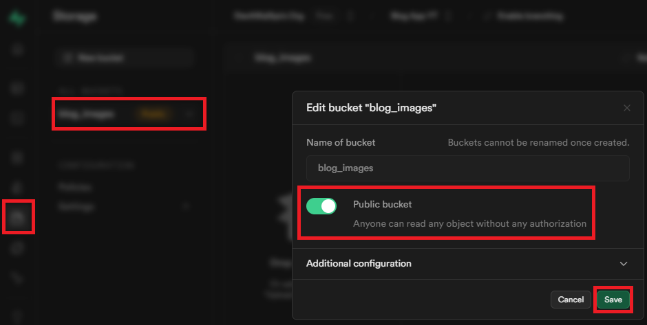

# install

```
flutter pub add supabase_flutter
flutter pub add shared_preferences
flutter pub add path_provider
```

```
dependencies:
  hive: ^4.0.0-dev.2
  isar_flutter_libs: ^4.0.0-dev.14
```

# export dependencies

```
export 'package:supabase_flutter/supabase_flutter.dart' show Supabase;
export 'package:shared_preferences/shared_preferences.dart'
    show SharedPreferences;
```

# supabase

[Build a User Management App with Flutter](https://supabase.com/docs/guides/getting-started/tutorials/with-flutter)

## User Management Starter

update user to database

[Set up the database schema](https://supabase.com/docs/guides/getting-started/tutorials/with-flutter#set-up-the-database-schema) with SQL


automatically creates a profile entry when a new user signs up via Supabase Auth
```
-- Create a table for public profiles
create table profiles (
  id uuid references auth.users not null primary key,
  updated_at timestamp with time zone,
  /* username text unique,
  full_name text,
  avatar_url text,
  website text, */
  name text,

  /* constraint username_length check (char_length(username) >= 3) */
  constraint name_length check (char_length(name) >= 3)
);
-- Set up Row Level Security (RLS)
-- See https://supabase.com/docs/guides/database/postgres/row-level-security for more details.
alter table profiles
  enable row level security;

create policy "Public profiles are viewable by everyone." on profiles
  for select using (true);

create policy "Users can insert their own profile." on profiles
  for insert with check ((select auth.uid()) = id);

create policy "Users can update own profile." on profiles
  for update using ((select auth.uid()) = id);

-- This trigger automatically creates a profile entry when a new user signs up via Supabase Auth.
-- See https://supabase.com/docs/guides/auth/managing-user-data#using-triggers for more details.
create function public.handle_new_user()
returns trigger as $$
begin
  /* insert into public.profiles (id, full_name, avatar_url)
  values (new.id, new.raw_user_meta_data->>'full_name', new.raw_user_meta_data->>'avatar_url'); */
  insert into public.profiles (id, name)
  values (new.id, new.raw_user_meta_data->>'name');
  return new;
end;
$$ language plpgsql security definer;
create trigger on_auth_user_created
  after insert on auth.users
  for each row execute procedure public.handle_new_user();

/* -- Set up Storage!
insert into storage.buckets (id, name)
  values ('avatars', 'avatars');

-- Set up access controls for storage.
-- See https://supabase.com/docs/guides/storage/security/access-control#policy-examples for more details.
create policy "Avatar images are publicly accessible." on storage.objects
  for select using (bucket_id = 'avatars');

create policy "Anyone can upload an avatar." on storage.objects
  for insert with check (bucket_id = 'avatars');

create policy "Anyone can update their own avatar." on storage.objects
  for update using ((select auth.uid()) = owner) with check (bucket_id = 'avatars'); */
```

create blogs table
```
-- Create a table for public blogs
create table blogs (
  id uuid not null primary key,
  updated_at timestamp with time zone,
  poster_id uuid not null,
  title text not null,
  content text not null,
  image_url text,
  topics text array,
  foreign key (poster_id) references public.profiles(id)
);
-- Set up Row Level Security (RLS)
-- See https://supabase.com/docs/guides/database/postgres/row-level-security for more details.
alter table profiles
  enable row level security;

create policy "Public blogs are viewable by everyone." on blogs
  for select using (true);

create policy "Users can insert their own blogs." on blogs
  for insert with check ((select auth.uid()) = id);

create policy "Users can update own blogs." on blogs
  for update using ((select auth.uid()) = id);

-- Set up Storage!
insert into storage.buckets (id, name)
  values ('blog_images', 'blog_images');

-- Set up access controls for storage.
-- See https://supabase.com/docs/guides/storage/security/access-control#policy-examples for more details.
create policy "Avatar images are publicly accessible." on storage.objects
  for select using (bucket_id = 'blog_images');

create policy "Anyone can upload an avatar." on storage.objects
  for insert with check (bucket_id = 'blog_images');

create policy "Anyone can update their own avatar." on storage.objects
  for update using ((select auth.uid()) = owner) with check (bucket_id = 'blog_images');
```

set blog_images Public

Storage->blog_images->Edit bucket->Public bucket
